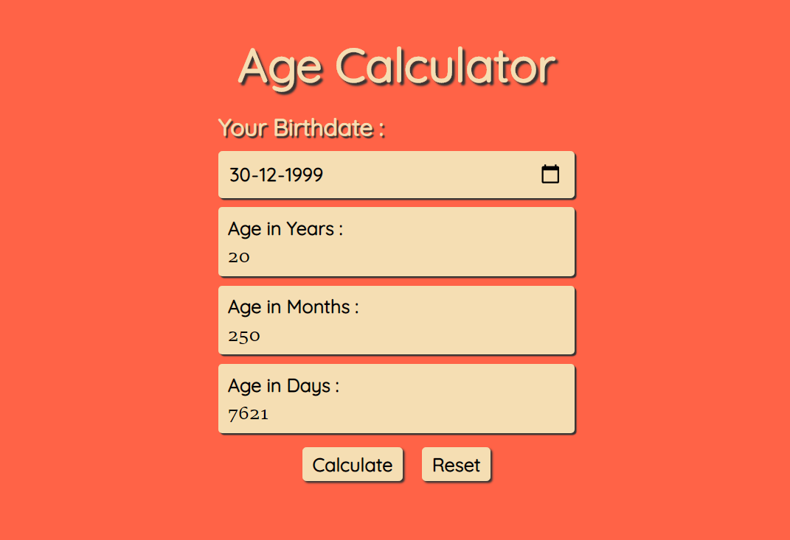

# Age Calculator
\
This is just a basic vanilla javascript which calculates your age in years, months and days :)
\
\

\
\
age calculator
[link](https://htmlpreview.github.io/?https://github.com/Ravi9076/age_Calculator/blob/main/index.html)

